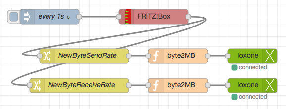

# node-red-contrib-loxone

This is a work-in-progress node to connect the Loxone Miniserver to
node-red. It uses [node-lox-ws-api](https://github.com/alladdin/node-lox-ws-api) 
by Ladislav Dokulil based on Loxone's documenation for the [Websocket API](https://www.loxone.com/dede/wp-content/uploads/sites/2/2016/08/loxone-communicating-with-the-miniserver.pdf).

It enables you to connect the Loxone Miniserver directly to node-red and work with the data
on occuring events. As this uses the official Websocket, you will only see controls that are 
visualized in Loxone-Config. 

Version `0.1.0` breaks compatibility with `0.0.x`. The nodes now reside in their own group in the palette and have changed 
names. Please readd your existing nodes accordingly.

**You will get the data from Loxone's websocket _as is_. There is and will be no abstraction layer!**
So please know how to handle the data according to the [structure file](https://www.loxone.com/dede/wp-content/uploads/sites/2/2016/08/loxone-structure-file.pdf?x48792) 
or the [webservice documenation](https://www.loxone.com/enen/kb/web-services/).

The connection to the miniserver is encrypted (hashed) via node-lox-ws-api (only for control-in and control-out), AES-256-CBC for command encryption 
is possible. It is kept alive via `node-lox-ws-api`.

> Help, pull requests and feedback in general are very welcome!

As I don't have an own Loxone installation, I can't do a "real world" test. 
Gladly a friend of mine lent me his spare miniserver for initial testing.

Tested with loxone-config V8.1.11.11, node-red 0.16.2, nodeJS 6.10.0 LTS

### Working parts so far
* Configure a miniserver connection 
* Control-In: Select a control and a state to hook an event which then gets passed to node-red on occurence.
* Control-Out: Select a control and feed it commands according to the [structure file](https://www.loxone.com/dede/wp-content/uploads/sites/2/2016/08/loxone-structure-file.pdf?x48792)
* Webservice: Send direct webservice call through the existing websocket, see the [webservice documenation](https://www.loxone.com/enen/kb/web-services/). 
Please use URI's inf form of `jdev/sps/io/foo` (no leading `/`), simply replace `dev/` from the documentation with `jdev/`.

The structure file can be retrieved via `http://<miniserver>/data/LoxAPP3.json`.

The `msg.payload` holds the value retrieved from the control's state. The `msg`-object also has some more information of
the selected control. For example:

    {
        payload: 20.8125,
        topic: "test ds18b20",
        state: "value",
        room: "Serverraum",
        category: "Temperatur",
        details: {
            format: "%.1f°"
        },
        type: "InfoOnlyAnalog"
    }
    
I've discovered that a switch element emits its current state (`active`) two times with the same value.
The first one when the trigger-button is pressed and second one when the button is released - so 
take care of this as it might give you unexpected results.
Also keep in mind, that this element sends `1/0` but expects to be fed with `On/Off/Pulse`.

~~Maybe you can point me out, how to get `I1-I8` directly via the WS-API.~~ As only visualized controls are
shown in the structure file, this won't work. Maybe this is now possible via the webservice node.

### Examples

Here's a small video of the controls above with the Loxone Webinterface on the left, Loxone-Config with LiveView enabled in the 
middle and node-red with node-red-dashboard on the right: https://cloud.codm.de/nextcloud/index.php/s/hNO2hIgnGIDWGqM

--- 

  
Another example: Reading the current used bandwith of a FritzBox-Router and display 
this data in the visualisation of the Miniserver:  https://cloud.codm.de/nextcloud/index.php/s/5XoNoMLilinpU4v
    
The flow itself could be found here: http://flows.nodered.org/flow/0b3c81b3361027ce4064d4e934f23685    

---

The webservice node, added in version `0.1.0`, allows you to directly call webservice URI's through the already 
established websocket connection.

As the `UpDownDigital` (etc.) virtual input has no state where the control-in node can listen to, I've switched it as 
an example via the webservice-node. See a short video here: https://cloud.codm.de/nextcloud/index.php/s/IttSURIGl8OkUBf

### Currently partially working, caveats

* ~~The "connected" info under the node in the editor is buggy atm~~
* ~~On initial configuration you have to deploy first, so that the runtime can connect to the MS, in order 
to load the structure file so you can select controls~~
* Only `controls` are parsed, no `mediaServer`, `weatherServer`, etc. 
  Is this enough? 
* ~~No `subcontrols`, yet~~
* ~~UpDownLeftRight digital/analog are not working at the moment~~ - solved with the webservice node

### ToDo 
* Convenience / Testing!
* ~~Connection handling on first configuration~~
* ~~More info in `msg`-object based on structure file~~
* ~~Configuration of the encryption method - currently only "Hash"~~
* ~~Loxone-Out~~ needs testing
* ~~SubControls~~ needs testing
* better logging, more failsaveness, more user info
* See `TODO` comments in the code
* ...

### Installation
Install the usual way. Either

    cd ~/.node-red/
    npm install node-red-contrib-loxone
    
or via node-red's `Manage palette`.

### Contributing

1. Fork it!
2. Create your feature branch: `git checkout -b my-new-feature`
3. Commit your changes: `git commit -am 'Add some feature'`
4. Push to the branch: `git push origin my-new-feature`
5. Submit a pull request :D

### Credits
Patrik Mayer with great help from [Ladislav Dokulil](https://github.com/alladdin), 2017 

I'm not affiliated with [Loxone](https://www.loxone.com/) in any way.

Many thanks to [Nick O'Leary](https://github.com/knolleary), [Dave Conway-Jones](https://github.com/dceejay/)
 and everyone else from the node-red Slack-Channel. 

### License
MIT

