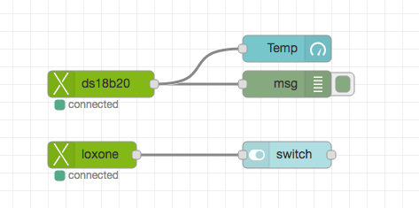

node-red-contrib-loxone
=
This is a work-in-progress node to connect the Loxone Miniserver to
node-red. It uses [node-lox-ws-api](https://github.com/alladdin/node-lox-ws-api) 
by Ladislav Dokulil based on Loxone's documenation for the [Websocket API](https://www.loxone.com/dede/wp-content/uploads/sites/2/2016/08/loxone-communicating-with-the-miniserver.pdf).

It enables you to connect the Loxone Miniserver directly to node-red and work with the data
on occuring events. For example you could hook-up an mqtt-node to push Loxone's data to an mqtt-broker.
Also you could, for example, switch something in the miniserver cause somebody tweeted something...

The connection to the miniserver is encrypted (hashed) via node-lox-ws-api, AES-256-CBC is possible. It is
kept alive via `node-lox-ws-api`.

> Help, pull requests and feedback in general are very welcome!

I've only tested it with a Temperature Sensor and a switch module so far as I don't 
have an own Loxone installation. Gladly a friend of mine lent me his spare miniserver.

Here's a small video with the Loxone Webinterface on the left, Loxone-Config with LiveView enabled in the 
middle and node-red with node-red-dashboard on the right.

https://cloud.codm.de/nextcloud/index.php/s/hNO2hIgnGIDWGqM

Currently working parts
-
* Configure a miniserver connection 
* Loxone-In node (no subcontrols)
* Loxone-Out node (no subcontrols)
* Loxone-In: Select a control and a state to "listen to" which then gets passed to node-red
* Loxone-Out: Select a control and feed it commands according to the [structure file](https://www.loxone.com/dede/wp-content/uploads/sites/2/2016/08/loxone-structure-file.pdf?x48792)

Tested with loxone-config V8.1.11.11

The structure file can also be retrieved via `http://<miniserver>/data/LoxAPP3.json`.
An explanation of the file can be found [here](https://www.loxone.com/dede/wp-content/uploads/sites/2/2016/08/loxone-structure-file.pdf)

**You will get the data from Loxone's websocket _as is_. There is and will be no abstraction layer!**
So please know how to handle the data according to the documentation.

The `msg.payload` holds the value retrieved from the miniserver. The `msg`-object itself holds more information of
the selected control. For example:

    {
        payload: 20.8125,
        topic: "test ds18b20",
        state: "value",
        room: "Serverraum",
        category: "Temperatur",
        details: {
            format: "%.1f°"
        },
        type: "InfoOnlyAnalog"
    }
    
I've discovered that a switch element emits it's current state (`active`) two times with the same value.
The first one when the trigger-button is pressed and second one when the button is released - so 
watch out for race conditions in your flow.
Also keep in mind, that this element sends `1/0` but expects to be fed with `On/Off/Pulse`.

Maybe you can point me out, how to get `I1-I8` directly via the WS-API.

Currently partially working, caveats
-
* The "connected" info under the node in the editor is buggy atm
* Only `controls` are parsed, no `mediaServer`, `weatherServer`, etc. 
  Is this enough? 
* No `subcontrols`, yet
* There's only marginal error handling for the editor

ToDo
-
* Convenience / Testing!
* ~~More info in `msg`-object based on structure file~~
* Configuration of the encryption method - currently only "Hash"
* ~~Loxone-Out~~ needs testing
* SubControls
* better logging, more failsaveness, more user info
* See `TODO` comments in the code
* ...

Installation
-
As the node has not reached a release version it is not yet published to npm.

So currently you have to checkout the repository manually and link it via `npm`. 
See https://nodered.org/docs/creating-nodes/packaging#testing-a-node-module-locally

    git clone git@github.com:codmpm/node-red-contrib-loxone.git
    cd node-red-contrib-loxone
    sudo npm link
    cd ~/.node-red
    npm link node-red-contrib-loxone
    
After that, restart node-red. The nodes will show up in the input and output category.

Contributing
-

1. Fork it!
2. Create your feature branch: git checkout -b my-new-feature
3. Commit your changes: git commit -am 'Add some feature'
4. Push to the branch: git push origin my-new-feature
5. Submit a pull request :D

Credits
-
Patrik Mayer, 2017 - I'm not affiliated with [Loxone](https://www.loxone.com/) in any way.

Many thanks to [Nick O'Leary](https://github.com/knolleary), [Dave Conway-Jones](https://github.com/dceejay/)
 and everyone else from the node-red Slack-Channel. 

License
-
MIT

