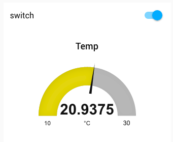

node-red-contrib-loxone
=
This is a work-in-progress node to connect the Loxone Miniserver to
node-red. It uses [node-lox-ws-api](https://github.com/alladdin/node-lox-ws-api) 
by Ladislav Dokulil based on Loxone's documenation for the [Websocket API](https://www.loxone.com/dede/wp-content/uploads/sites/2/2016/08/loxone-communicating-with-the-miniserver.pdf).

The connection is encrypted (hashed) via node-lox-ws-api.

> Help, pull requests and feedback in general are very welcome!

I've only tested it with a Temperature Sensor and a Switch module so far as I don't 
have an own Loxone-Installation. Gladly a friend of mine lent me his spare miniserver.

Currently working
-
* Configure a miniserver connection 
* Loxone-In node
* Load structure file into node-red's editor to choose from
* Select a control and a state to "listen to" which then gets passed to node-red
* Control-name State-Name are given back in the `msg`-object

You can narrow the result by choosing a room or a category. 

Your structure file can be retrieved via `http://<miniserver>/data/LoxAPP3.json`
An explanation of the file can be found [here](https://www.loxone.com/dede/wp-content/uploads/sites/2/2016/08/loxone-structure-file.pdf)

Currently partially working, caveats
-
* You have to load the structure file every time you edit a node - should be cached
* The "connected" info under the node in the editor is buggy atm
* Only `controls` are parsed, no `mediaServer`, `weatherServer`, etc. 
  Is this enough? 
* ...
  
I've discovered that a switch element emits it's current state (`active`) two times.
One when the trigger-button is pressed and another when the button is released.

Maybe you can point me out, how to get I1-I8 directly via the WS-API.

ToDo
-
* Convenience / Testing!
* More info in `msg`-object based on structure file
* Configuration of the encryption mehthod - currently only "Hash"
* Loxone-Out
* better logging, more failsaveness
* See `TODO` comments in the code
* ...

Installation
-
As the node has not reached an initial version it is not published via npm.

So currently you have to checkout the repository manually, see 
https://nodered.org/docs/creating-nodes/packaging#testing-a-node-module-locally

    git clone git@github.com:codmpm/node-red-contrib-loxone.git
    cd node-red-contrib-loxone
    sudo npm link
    cd ~/.node-red
    npm link node-red-contrib-loxone
    
After that, restart node-red.    

Contributing
-

1. Fork it!
2. Create your feature branch: git checkout -b my-new-feature
3. Commit your changes: git commit -am 'Add some feature'
4. Push to the branch: git push origin my-new-feature
5. Submit a pull request :D

Credits
-
Patrik Mayer, 2017 - I'm not affiliated to [Loxone](https://www.loxone.com/) in any way.

Many thanks to [Nick O'Leary](https://github.com/knolleary), [Dave Conway-Jones](https://github.com/dceejay/)
 and everyone else from the node-red Slack-Channel. 

License
-
MIT

