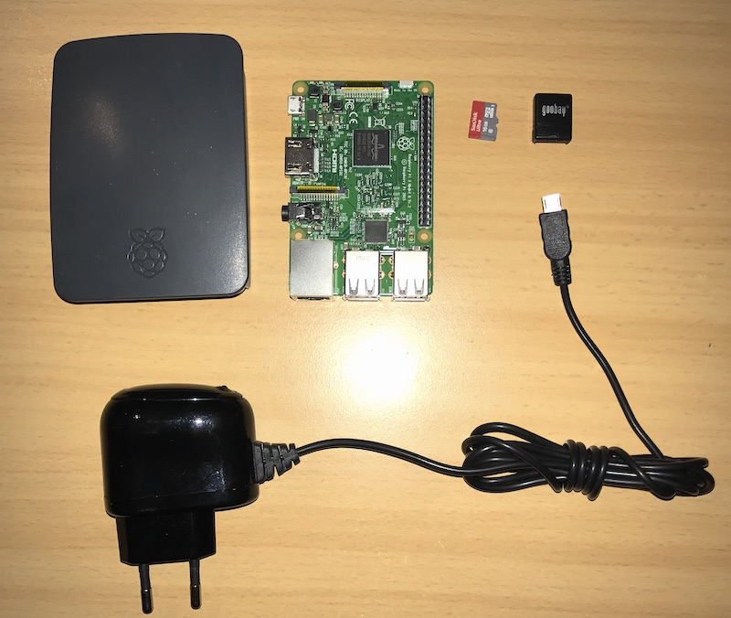
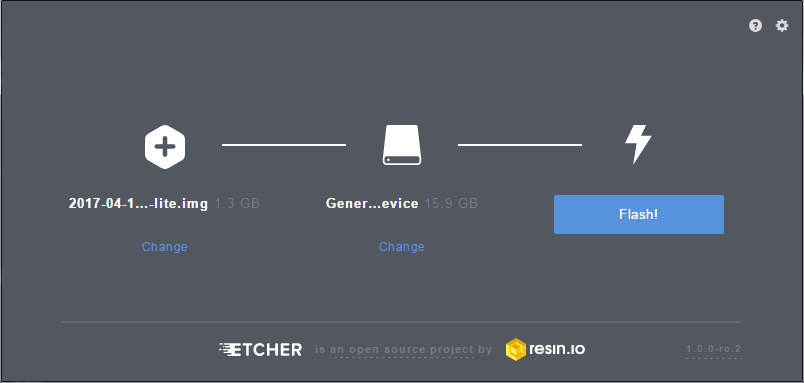
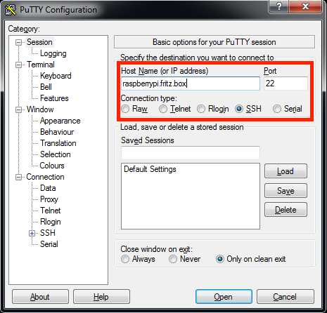
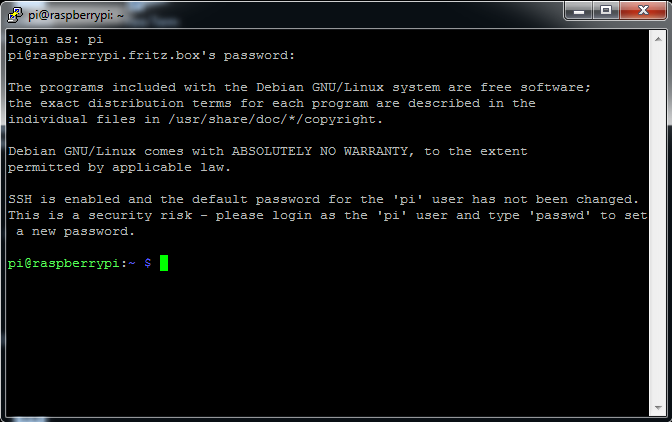
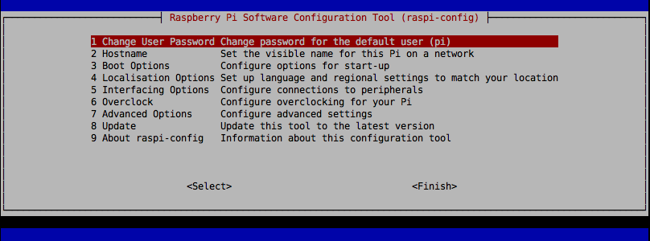
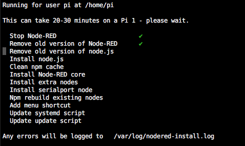
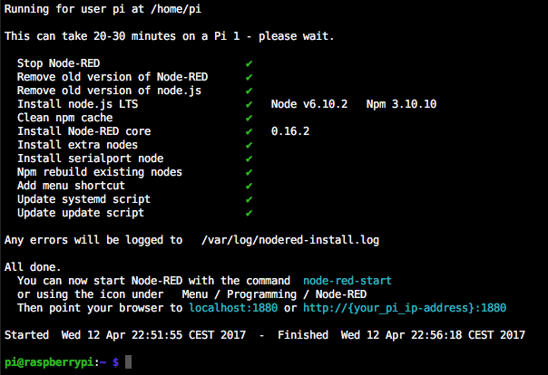
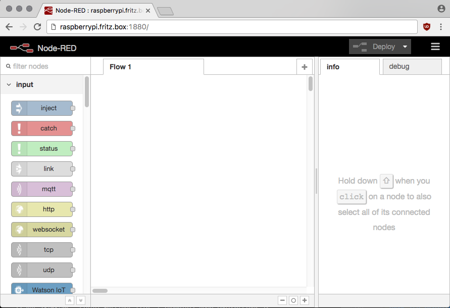
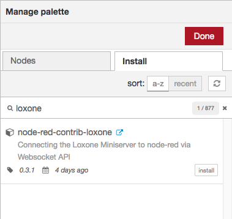
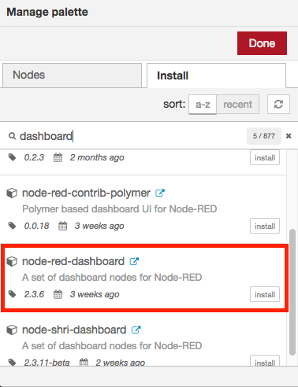

# Installation node-red/node-red-dashboard/node-red-contrib-loxone auf RaspberryPi

Das vermehrt die Frage aufkam, wie man denn mit node-red starten kann, versuche ich mal den 
üblichen weg - die Installation auf einem Raspberry Pi - zu erklären. Die Wahl fiel auf den
 Raspberry Pi 3B, weil dort für unter 1 Watt genug Leistung und Schnittstellen zur Verfügung 
 stehen um eine komplette Automation aufzubauen. Außerdem sind für diese Plattform sehr viele 
 Tutorials zu haben und preislich kommt man auch gut zurecht.

Ich bestelle meine Pi's bei reichelt. Dort ist der Service vorzüglich und der Preis gehört 
mit zu den günstigsten. Natürlich könnt ihr auch irgendwo anders kaufen. Wenn gewünscht
stelle ich gerne eine Liste mit Artikelnummern zur Verfügung.

Ich empfehle aber auf jeden Fall ein 2A-Netzteil und eine Marken-Micro SD (Class 10, 8GB). 

_Im Bild das offizielle Case, Raspberry Pi 3, MicroSD-Karte und -Leser (oben rechts) sowie 
GooBay 5V/2A Netzteil._

## Installation 
Um mit einem Pi starten zu können, muss zuerst ein Betriebssystem auf der SD-Karte installiert
werden. Der Pi hat sonst keinen Massenspeicher und so dient die SD-Karte als "Festplatte".

Um ein Betriebssystem-Image (Abbild) auf eine SD-Karte zu schreiben, benötigt man ein passendes Programm.
Im Beispiel verwende ich [Etcher](https://etcher.io/), das für Windows, Linux und MacOS verfügbar ist.
Natürlich geht auch der Win32DiskImager für Windows, `dd` unter Linux oder der ApplePi Baker unter OSX.

Zuerst lädt man also Etcher von https://etcher.io/ herunter und installiert diesen.

Als Betriebssystem entscheiden wir uns für das offizielle Raspbian-Linux von 
https://www.raspberrypi.org/downloads/raspbian/.
Da wir keine Desktop-Umgebung benötigen, ladet bitte das dort angeboten `Raspbian Lite` herunter.

Startet nun Etcher und wählt als "Laufwerk" euren SD-Kartenleser mit eingesteckter SD-Karte (mind. 4GB), 
sowie `<datum>-raspbian-jessie-lite.img` als "Image":

Nach einem beherzten Klick auf `Flash` könnt ihr euch erst mal ein erfrischendes Kaltgetränk 
oder einen Kaffe genehmigen ;-) Nach ein paar Minuten ist das Image dann schon auf der SD-Karte 
und wird noch durch Etcher verifiziert.

Super - ihr habt soeben ein Linux-Image auf eine SD-Karte geflasht!

Bevor ihr die SD-Karte auf dem Leser nehmt, öffnet das Laufwerk `BOOT` und legt dort eine leere 
Datei namens `shh` (ohne Erweiterung) an. Eventuell müsst ihr die SD-Kart ein mal ziehen und wieder 
einstecken, damit euch das Laufwerk angezeigt wird. 

Da wir ein Raspbian ohne Desktop genommen haben müssen wir ja irgendwie zum Konfigurieren 
auf den Pi kommen. Dazu nutzt man SSH (Secure Shell) um über einen Terminal die Kommandozeile
zu bedienen. Seit letztem Jahr ist der SSH-Server aber standardmäßig deaktiviert, da einfach
viel zu viele Leute Ihren Pi mit Standardpasswort im Internet hatten. Mit dem Anlegen der leeren
Datei schaltet man den SSH-Server dann explizit ein.

## Erster Start
Steckt nun die fertige SD-Karte in den SD-Kartenslot des noch stromlosen Raspberry Pis. 
Die Karte im Computer bitte über die Funktion "Sicher entfernen" oder `umount` aushängen.
  
* Ihr benötigt weder Tastatur noch Monitor am Raspberry Pi.
* Versorgt den Pi mit einem Netzwerkkabel, das mit eurem Heimnetz verbunden ist.
* Steckt dann das Netzteil zuerst in den Pi und dann in die Steckdose

Die rote LED sollte durchgehend Leuchten, die Gelbe sollte in unregelmäßigen Abständen 
blinken. Juhuuu - der Raspberry Pi bootet.

## Zugriff auf den Pi
Ich gehe davon aus, dass ein funktionierender DHCP-Server im Netz vorhanden ist und der Pi 
sich damit automatisch mit einer IP-Adresse versorgt.

Üblicherweise kann man die IP, die dem Pi zugeordnet wurde, im Interface des Router einsehen. 
Auf einer Fritz!Box beispielsweise geht das unter `Heimnetz -> Heimnetzübersicht -> Netzwerkverbindungen`:

_Bitte nicht irritieren lassen: Der Pi hat nur ein 100MBit/s Interface, ist in meinem Netz aber über 
einen Switch angeschlossen, der der Fritzbox gegenüber Gigabit hat._

Der Pi ist also über die nun bekannte IP erreichbar! Wenn man eine FritzBox besitzt, ist er - 
genauso wie jedes andere Netzwerkgerät - auch über den Namen `raspberrypi.fritz.box` erreichbar.
Gleiches gilt für andere Router (`raspberrypi.speedport.ip`, `raspberrypi.easy.box`, etc.).

Leute die den Bonjour Dienst und IPV6 auf Ihrem Computer aktiviert haben (OSX, Linux), können
den Pi auch unter `raspberrypi.local` erreichen.

Wie bekommt man nun also Zugang über SSH auf den Pi? 

### Windows
  Hier kann man zum Beispiel [Putty](http://www.chiark.greenend.org.uk/~sgtatham/putty/latest.html) 
  verwenden. Für jeden anderen SSH-Client (SecureCRT, KiTTY, etc.) sind die Schritte analog auszuführen.
  
  Startet also PuTTY und gebt den Hostnamen oder die IP ein und wählt `SSH` (Standard):
  

  Beim ersten Verbinden werdet ihr mit einer Warnung begrüßt:
  
  
  Diese Meldung ist völlig normal. SSH arbeitet mit sogenannten Host-Keys, wovon jeder SSH-Host einen 
  zufällig bei der Installation des SSH-Servers generierten besitzt. Bestätigt den für euch 
  "neuen" SSH-Host-Key einfach mit "Ja". PuTTY wird euch melden wenn unter dem gleichen Namen ein 
  andere SSH-Host-Key präsentiert wird.
  
  PuTTY verbindet sich daraufhin mit dem SSH-Server des Raspberry Pi und möchte anschließend 
  einen Benutzernamen (`login`) von euch wissen. Nach Eingabe des Benutzers folgt logischerweise
  das Passwort für den von euch angegebenen Benutzer.
  
  Bei der Erstinstallation ist der Benutzer `pi` und das Passwort lautet `raspberry`.
  
  Ihr seid auf der Shell:
  
  

### OSX / Linux
  Öffnet ein Terminal und gebt `ssh pi@<host/ip>` in die Konsole ein. Danach müsst ihr nur noch den 
  oben (Windows) bereits  erwähnten SSH-Host-Key mit `yes` bestätigen und das Passwort für den Benutzer `pi`
  eingeben.
  
  Als Beispiel: `ssh pi@raspberrypi.fritz.box` oder `ssh pi@raspberrypi.local`.
  
  Bei der Erstinstallation ist der Benutzer `pi` und das Passwort lautet `raspberry`.
  
  Ihr seid auf der Shell:
  
  
## Erste Schritte
Zuerst solltet ihr euren Pi mal auf den aktuellen Stand bringen!
    
Unter Linux gibt es einen administrativen Benutzer (`root`) der alles im System darf. Es 
empfiehlt sich nicht als dieser Benutzer zu arbeiten, da einfach durch Unwissenheit zu viel 
am System beschädigt werden könnte.

Um also trotzdem Dinge mit Administratorrechten ausführen zu können, gibt es das Kommando 
`sudo` - SUper User DO. Der Benutzer `pi` ist bereits für die sudo-Berechtigung freigeschaltet.

Normalerweise muss für diesen Vorgang das eigene Passwort zur Legitimation eingegeben werden, 
auf dem Pi ist dies, für die Bequemlichkeit, deaktiviert.
 
Wir updaten also das System: 
 
    sudo apt update
    sudo apt full-upgrade

`apt update` aktualisiert die im System hinterlegten Paketquellen und die Liste der installierbaren
Pakete. `apt full-upgrade` aktualisiert - wie zu vermuten ist - alle Pakete für die es Updates gibt.

Dann steht üblicherweise ein Reboot an, da normalerweise auch der Kernel des Systems aktualisiert 
wurde. 

    sudo reboot

Wenn `apt update` mit der Meldung `All packages are up to date.` beendet wurde, ist man bereits 
auf dem aktuellen Stand und braucht `apt full-upgrade` nicht mehr auszuführen.
  
Unter Linux muss typischerweise nicht das komplette System neu gestartet werden um einen einzelnen 
Dienst neu zu starten oder zu aktualisieren. Wenn allerdings der Kern des Betriebssystems (Kernel)
aktualisiert wurde, kommt man um einen Reboot nicht herum.

## Raspberry Pi Grundkonfiguration
Raspbian bringt eine leicht bedienbare Konfiguration mit - genannt `raspi-config`.

Startet diese mit `sudo raspi-config` und ihr werdet mit folgendem Fenster begrüßt:
 
 

Das Programm lässt sich mit den Pfeiltasten, Enter, ESC und TAB bedienen. Wählt zuerst 
`Change User Password` und gebt eurem Benutzer `pi` ein vernünftiges Passwort. 
Nach dieser Änderung müsst ihr euch zukünftig mit dem selbst vergebenen Passwort 
authentifizieren.

Wer möchte kann unter `Localisation Options` noch Deutsch auswählen. Die Sprache ist 
nicht wirklich wichtig, allerdings solltet ihr in jedem Fall die Zeitzone richtig setzen.
Typischerweise ist das `Europe/Berlin`.

Als nächstes ist es wichtig unter `Advanced Options` das Dateisystem mittels `Expand Filesystem`
zu vergrößern, damit der komplette Platz auf der SD-Karte genutzt wird.

Danach könnt ihr mit TAB auf `<Finish>` springen und mit Enter bestätigen. Da ihr am Dateisystem
Änderungen vorgenommen habt, solltet ihr den Pi mit `sudo reboot` letztmalig neu starten.

Mit `sudo halt` fahrt ihr das System herunter. Jedes mal wenn ihr plant den Pi vom Strom 
zu trennen, solltet ihr dies tun. Dateisysteme mögen es im Allgemeinen nicht, wenn man ihnen 
einfach den Boden (Strom) unter den Füßen weg zieht.

## Installation node-red
Node-Red ist in NodeJS geschrieben und benötigt zur Installation und für den Betrieb logischerweise 
Node JS und den Node Package Manager (npm).

Die Jungs von Node-Red stellen ein Script zum Update von NodeJS, NPM und zur automatischen 
Installation von Node-Red unter http://nodered.org/docs/hardware/raspberrypi zur Vefügung.
Natürlich werden wir dieses hier nutzen.

Verbindet euch erneut per SSH mit dem Pi.

Copy & Pasted nun diese Zeile in die Shell: 

    bash <(curl -sL https://raw.githubusercontent.com/node-red/raspbian-deb-package/master/resources/update-nodejs-and-nodered)

_(In PuTTY müsst ihr mit `SHIFT-EINFG` einfügen, da `STRG-V` nicht funktioniert.)_

Das Script erklärt euch kurz was nun passieren wird, was ihr natürlich mit `y` bestätigen müsst.
Danach startet auch bereits die automatische Aktualisierung und Installation von node-red.

__Hinweis:__ Nicht einfach irgendwelche Shellkommandos, die Ihr im Internet gefunden habt
ausführen. Wie hier wird oft ein externes Script nachgeladen, was in diesem Moment genau genommen
alles mit eurem System anstellen kann.

Nach einiger Zeit, abhängig davon ob ihr einen Pi 1, 2 oder 3 verwendet, ist die Installation 
abgeschlossen:

Um Node-Red zu starten, gebt nun einfach `node-red-start` ein. Damit wird node-red 
gestartet und ist ab diesem Zeitpunkt unter `https://<ip/host>:1880` erreichbar.

Also Beispielsweise unter `http://raspberrypi.fritz.box:1880`.

Um Node-Red zu stoppen, drückt einfach `STRG-C` und der Prozess wird beendet.

__Achtung:__ Um beim nächsten Reboot Node-Red automatisch zu starten, muss es als Systemdienst installiert werden. 
Dies geschieht mit 

    sudo systemctl enable nodered.service
   
Um den Dienst zukünftig neu zu starten, zu stoppen oder erneut zu starten wenn er gestoppt wurde, nutzt man:
   
    sudo service nodered restart
    sudo service nodered stop
    sudo service nodered start
    
Man kann also auch ohne einen Reboot, nachdem man Node-Red als Systemdienst eingetragen hat, 
das Ganze mit `sudo service nodered start` starten. 
   
## Installation von Nodes
Am einfachsten geschieht dies über den Palette Manager von Node-Red:

Dort sieht man die bereits installierten Nodes und kann unter `Install` nach Nodes, 
die man installieren möchte, suchen.

Durch Klick auf `install` wird der gewünschte Node installiert und ist ab diesem Zeitpunkt
in der "Palette" (links) verfügbar.

### node-red-dashboard
`node-red-dashboard` installiert man auf genau dem gleichen Weg:

Nach der Installation ist dann das "Dashboard" unter `http://raspberrypi.fritz.box:1880/ui/` 
verfügbar. Natürlich ist dort noch nicht viel zu sehen, da ihr ja noch keine Nodes für 
das Dashboard angelegt habt ;-)

### Manuelle Installation
Natürlich können nodes auch auf der Kommandozeile installiert werden. Verbindet also
wieder per SSH mit dem Pi und wechselt in das Verzeichnis in den Node-Red seine zugehörigen
Dateien ablegt. Typischerweise im Home-Verzeichnis des Benutzers der Node-Red ausführt, 
in unserem Fall also `/home/pi/.node-red/`.

Auf die Schnelle kann man mit `~` in das home-Verzeichnis wechseln, also für uns 
 `cd ~/.node-red`.
 
Dort kann man mit `npm install <kompletter-name-des-nodes>` einen node installieren.
Zum Beispiel: `npm install node-red-contrib-loxone`.

## Update von Nodes
Leider ist das Update der Nodes (noch) nicht so einfach. Für Node-Red Version `0.17` ist geplant, dass
das Update über den Palette Manager möglich ist. Aktuell muss das aber noch per Hand passieren.

Dies funktioniert genau wie die manuelle Installation:

    cd ~/.node-red
    npm update
    
`npm update` aktualisiert alle nodes, für die ein Update ansteht - `npm update <node>` nur den angegebenen.

## Deinstallieren von Nodes
Aus technischen Gründen ist das nicht über das Webinterface möglich, muss also immer 
per Hand passieren:

    cd ~/.node-red
    npm remove <node>
    

## Conclusion
Ich hoffe ich konnte euch ein wenig die Anfangsangst im Umgang mit dem Raspberry Pi, 
mit Linux und mit der Installation von Node-Red nehmen.
 
Feedback und Anregungen gerne an mich.

## License / Credits
CC-BY-SA 2017 by patrik.mayer@codm.de, https://www.codm.de